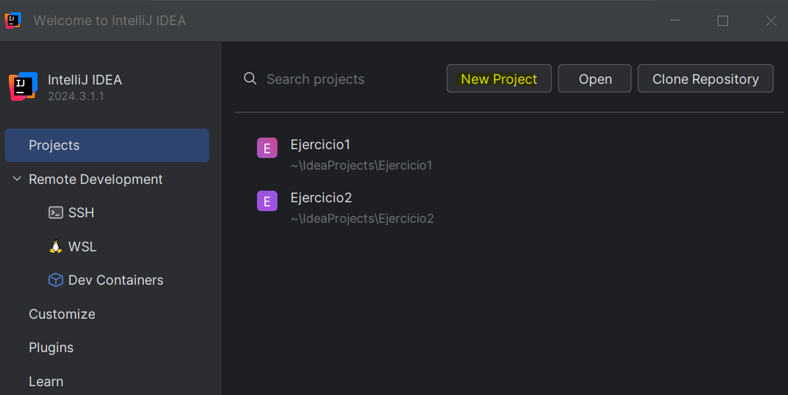
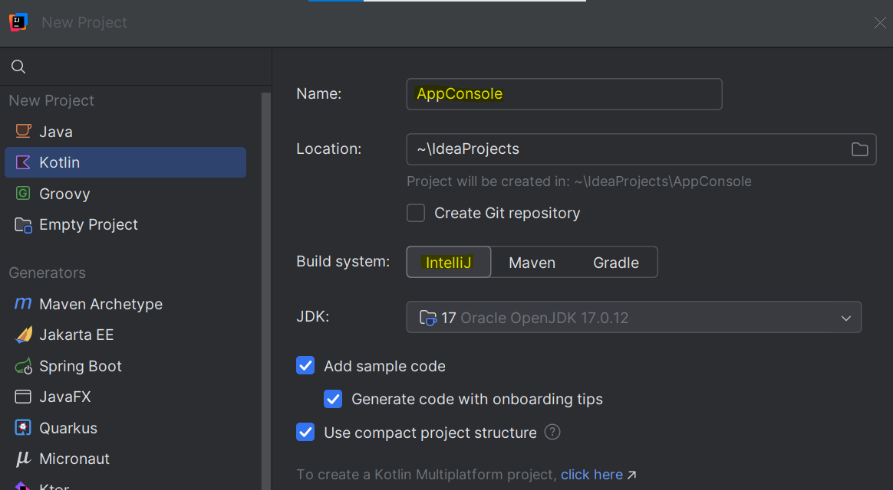
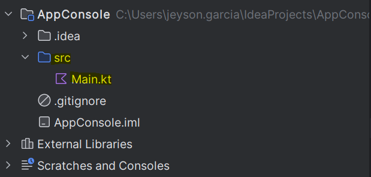
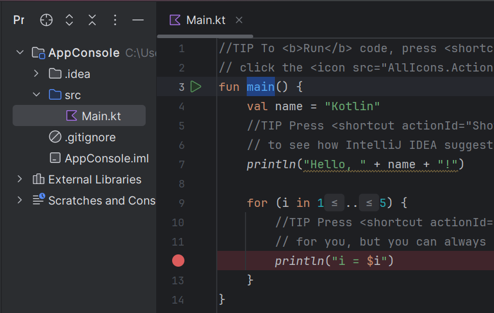
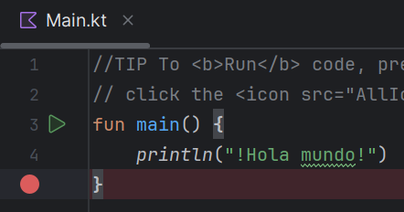
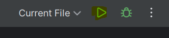
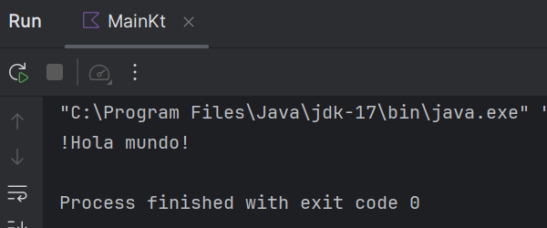

# ¿Cómo crear una aplicación JVM en Kotlin?

En este ejercicio vamos a crear la típica aplicación base de todos los lenguajes de programación : **!Hola mundo!**. Esta aplicación solo muestra por consola la palabra : **!Hola mundo!**. El IDE que usaremos es : **IntelliJ IDEA**. 

1. En **IntelliJ IDEA** vamos a dar click sobre el botón **New Project**

:::tip
Una **aplicación de consola** es aquella que se ejecuta sobre un **computador de escritorio**. 
:::

2. Vamos a modificar el nombre de nuestro proyecto y vamos a seleccionar el **sistema de compilación** de **IntelliJ**. Este **sistema de compilación** es común para proyectos
personales que no requieren descarga de artefactos adicionales. 

:::tip
Un **sistema de compilación** combina y simplifica algunas de las **tareas** clave involucradas en la **compilación** y **distribución** del programa.
:::

3. Después de creado el proyecto se crean automáticamente un conjunto de carpetas y sub-carpetas. La sub-carpeta **./src** es la más importante. En ella encontraremos el
código fuente de nuestra aplicación. 

4. El archivo **Main.kt** es el archivo principal. En este archivo se encuentra la función **main** encargada de ejecutar la aplicación. 

5. Finalmente modificaremos el contenido de la función **main** para que muestre unicamente por consola la palabra : **!Hola mundo!**

6. Para ejecutar nuestra aplicación debemos dar click sobre el botón play 

7. Después de compilar el código fuente, el resultado de nuestra aplicación será proyectado en el terminal del IDE. 

